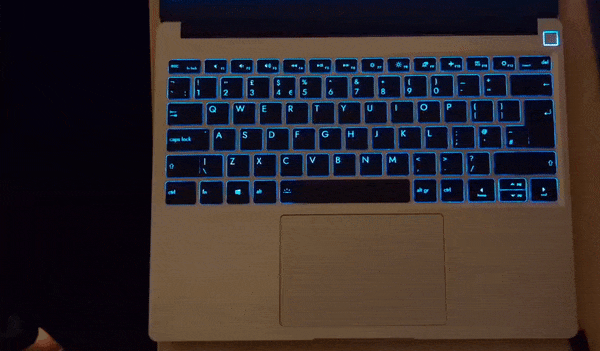
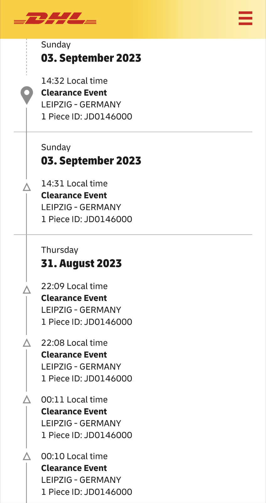
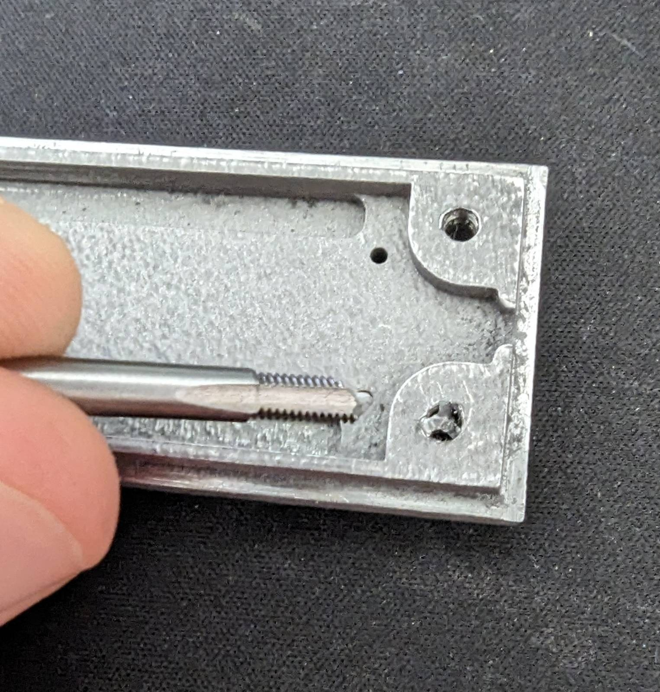

# kEeB_UpGrAdE

## What is this?

A Raspberry Pi Pico that handles the following:

1. Hardware-accellerated sarcasm for your keyboard.  

2. Resolving issues with certain keyboard layouts, allowing remapping in realtime. This particular fix can resolve issues like:    
After investigation, the root cause of this was an issue with the keyboard firmware called `colemak-dh`. This strange layout causes keys not to land in the right `qwerty` places. In theory this functionality can be extended to cover other similar keyboard issues.  
**Warning:** incorrect application of this tool can cause unexpected inputs.

## How do I use it?

### Mechanical 

1. Plug cable in kEeB
2. Plug cable into kEeB
3. Plug kEeB into computer
4. Start typing

### Shortcuts

- SaRcAsM mOdE
    - `super + ctrl + x`  
    
- Colemak layout-fix 
    - `super + ctrl + f`  
    

## Why would anyone want this tho?

## How do I make my own?

### Tools required

- Electrical:  
    - Raspberry Pi Pico (other flavours are available but not necessarily supported)
    - Micro USB to male USB-\<something>
    - Female USB-A to _anything_ (it doesn't matter, this one's getting the snip)
    - Sidecutters (or knife)
    - Soldering iron
    - Solder (ideally unleaded if you like having braincells)  
- Mechanical:
    - 3D printer (or 3D printing service)
    - 6 M2 * 4mm bolts
    - 4 M3 * 6mm bolts
    - Tap set M2 & M3 **or** heat set inserts ([Ruthex makes good ones](https://www.amazon.de/ruthex-Gewindeeinsatz-Sortimentskasten-St%C3%BCck-Kunststoffteile/dp/B08K1BVGN9))

### The Pico:
Plug the micro usb cable into the pico's USB port, instructions on how to do this with a generic usb port can be found in the media above.
The other cable:
- Snip it
- Solder power & ground to Pico VBUS & GND (don't mix these up - the magic smoke only flows one way)
- Solder the data cables to GPIO 0 & 1

### The software:

**Option A:** 

1. Clone the repo: `git clone git@github.com:darts/kEeB_UpGrAdE.git --recurse-submodules`
2. Install the [Pico SDK](https://github.com/raspberrypi/pico-sdk)
3. (Optional) make any <del>fixes</del> tweaks you like
4. From the root of the repo, build the binary: `mkdir build && cd build && cmake .. && make`

**Option B:**

1. Download the build binary from the [GitHub releases](https://github.com/darts/kEeB_UpGrAdE/releases). I personally wouldn't download a random binary for something that is _designed_ to sniff keystrokes but you do you.

**Installation:**

If you built it yourself, the binary is: `kEeB_UpGrAdE/build/src/kEeB.uf2`.  
If you downloaded the GitHub release, the binary is wherever you left it.

1. Press and hold the `BOOTSEL` button on the Pico while plugging it into the computer.
2. It will appear as an external storage device, copy the binary to the Pico.
3. The Pico should disconnect and boot with the new firmware. Now is a good time to test if it works before bolting the whole thing together.
4. (Optional) If the keyboard input looks mega wonky you probably have the TX and RX lines crossed on the Pi, switch them.

### The case:
1. Download the STLs
2. Either print them yourself or upload them to your favourite printing service
3. Creating the threads:  
    a. If the case is printed in thermoplastic, drill out the holes to the correct diameter and insert the heat set inserts  
    b. Tap the threads with the tap set
4. (Optional) If the case is conductive apply Kapton or other insulating tape to the case
5. Fasten the Pico and strain relief (or fill the thing with hot glue and pretend it's fine)
6. Place the top half of the case and add the bolts

## Side notes:

### The case

If you live in Germany and do not own your own 3D printer and decide to get it printed by a service not based in the EU (brought to you by today's sponsor [JLCPCB](https://jlcpcb.com/3d-printing?from=3DP)), you can look forward to something like this:

This case took twice as long to deliver as was advertised thanks to DHL's incompetence. In hindsight I should have just paid for express shipping on my own 3D printer. DHL's "Express Shipping" requires you to call them multiple times so they know they can move your parcel from one end of the warehouse to the other with the documents you provided a week ago. Then the delivery driver can pretend to deliver your post claiming "no one was home". I have a problem with DHL charging 30$ for express shipping that takes longer than getting it shipped by [pigeon](#the-speed-of-a-pigeon). And then to claim that "no one was home" and "your delivery can be picked up at your local DHL office in 2 days" is a _load of shite_.

### Metal case

There were a few issues with the case I had printed. Most of them were my fault. A short list:

1. Tolerances. The tolerances in the models were waaaaay too tight. I've adjusted them since but spending 8 hours filing down stainless by hand is not a good way to spend a Saturday.
2. Material. Stainless is a bitch. It'll ruin your tools, snap your taps and probably steal your girl. 

3. The case warped during printing. I hope it's not too difficult to imagine why a stainless steel case made of two pieces designed to fit snugly together is not fun to work with when the two halves are banana'd in different directions.

### The speed of a pigeon

Assuming DHL employs [professional pigeons](https://en.wikipedia.org/wiki/Homing_pigeon) rather than amateurs we can estimate a cruising speed of approximately 100km/h (see source above). The distance from Shenzhen to Berlin is approximately 8,700km meaning a pigeon could travel that distance in ~87 hours. As we are deeply concerned with the working hours of pigeons we don't want them flying more than 8 hours/day. Our pigeon could then have made the trip in 11 days, less than the 14 DHL required. 
